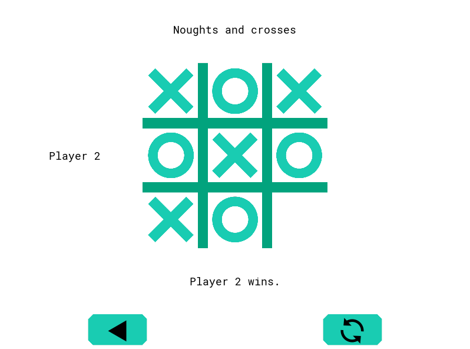

# Kivy Games

Kivy Games is a small project made to learn how to use Kivy, Cython and PyPI. It includes simple games that can be played against AIs or other players.

## Games

The games currently included are:

* Noughts and crosses
* Rock, paper, scissors

## Installation

This section is not complete yet.

## Contributing

All pull requests are welcome. Please open issues for any major changes.

## License

[MIT](https://choosealicense.com/licenses/mit/)
